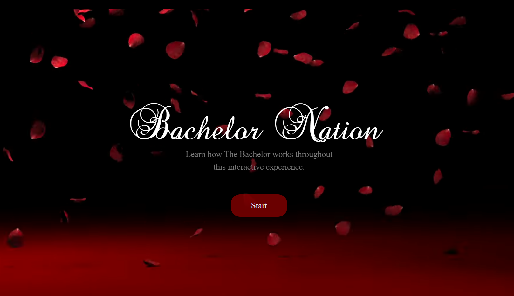
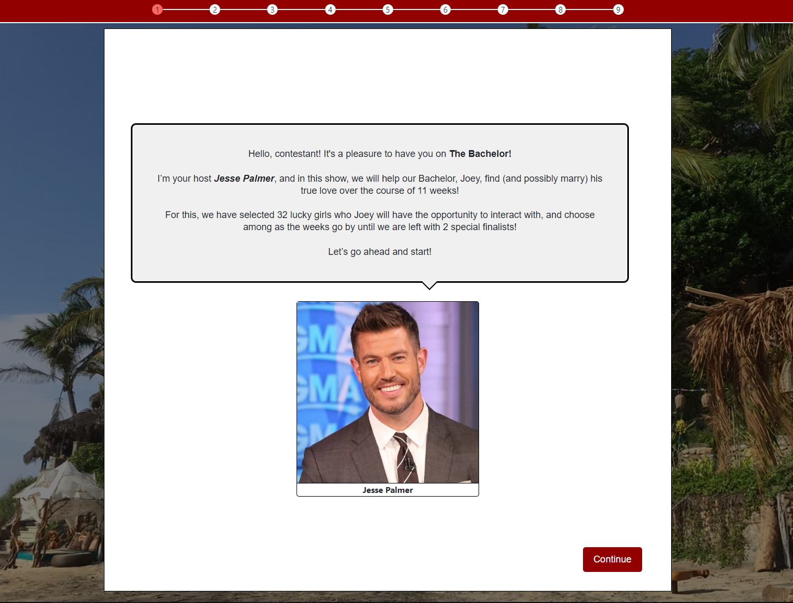
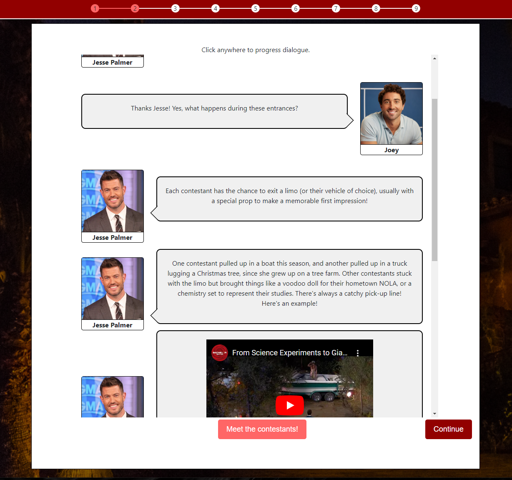
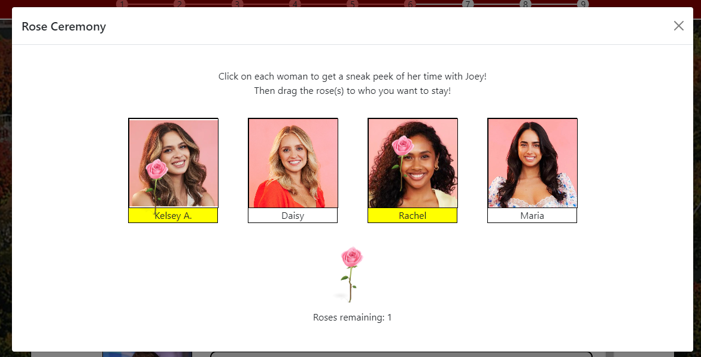
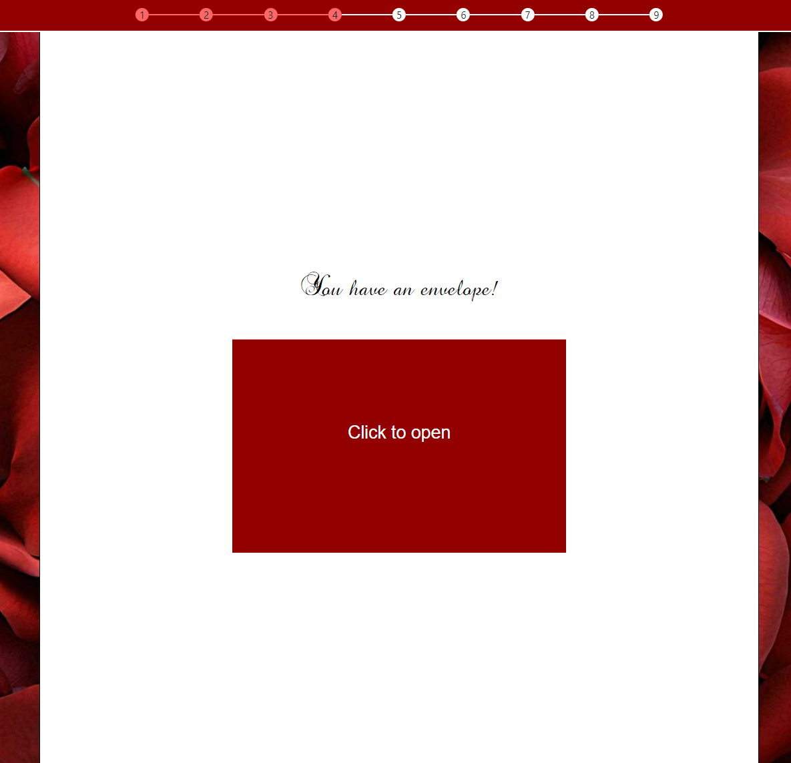
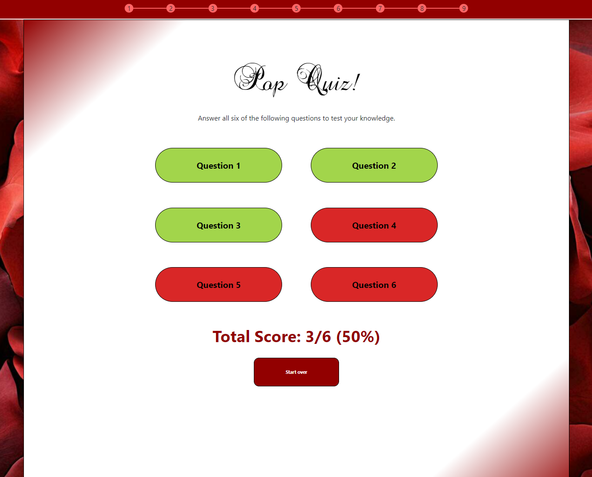
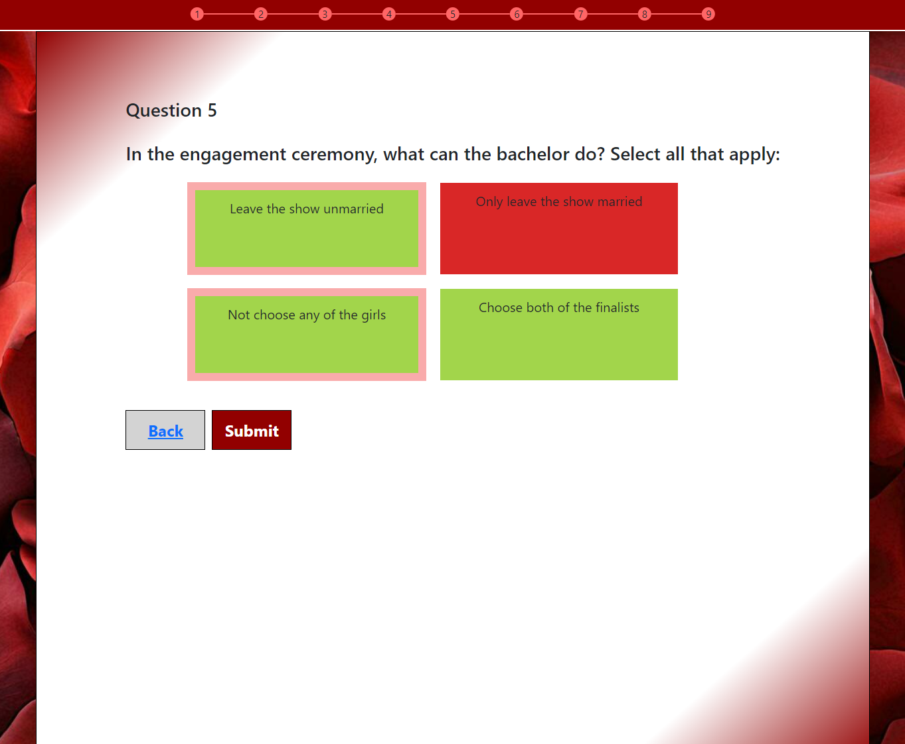

# Bachelor-Nation-Flask-Site
Learn how the Bachelor works with this interactive Flask app! You will be walked through a season of the show, participate in imitation rose ceremonies, and complete a quiz to test your knowledge at the end of the experience.
<br><br>
Here's a demo video: https://youtu.be/17t3T9URkU8
<br><br>

## Contributors

👨‍💻 **Quinn Booth**<br>
👨‍💻 **Dani Dassum**<br>
👨‍💻 **David Nguyen**<br>
👨‍💻 **Alice Wang**<br>

## Setup

1) Clone this repo and cd into the main folder.

2) Run ```python server.py``` to start the Flask project up (make sure Flask is downloaded).

3) Follow the link logged in your console to visit the website on localhost.


# Images of Website

Here is a set of images taken throughout the experience. Watch the demo above to see them in action!

<p align="center">
  
  <br>
  <em>Figure 1: Homepage.</em>
</p>
<br>

<p align="center">
  
  <br>
  <em>Figure 2: Learning page.</em>
</p>
<br>

<p align="center">
  
  <br>
  <em>Figure 3: Dialogue page.</em>
</p>
<br>

<p align="center">
  
  <br>
  <em>Figure 4: Rose ceremony.</em>
</p>
<br>

<p align="center">
  
  <br>
  <em>Figure 5: Envelope page.</em>
</p>
<br>

<p align="center">
  
  <br>
  <em>Figure 6: Quiz homepage.</em>
</p>
<br>

<p align="center">
  
  <br>
  <em>Figure 7: Quiz question example.</em>
</p>
<br>
